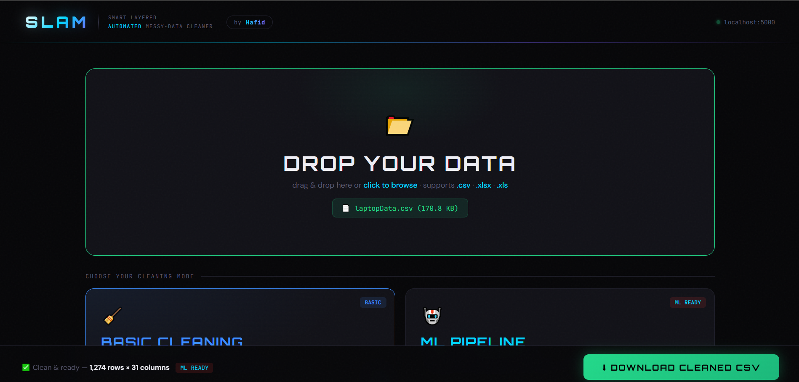
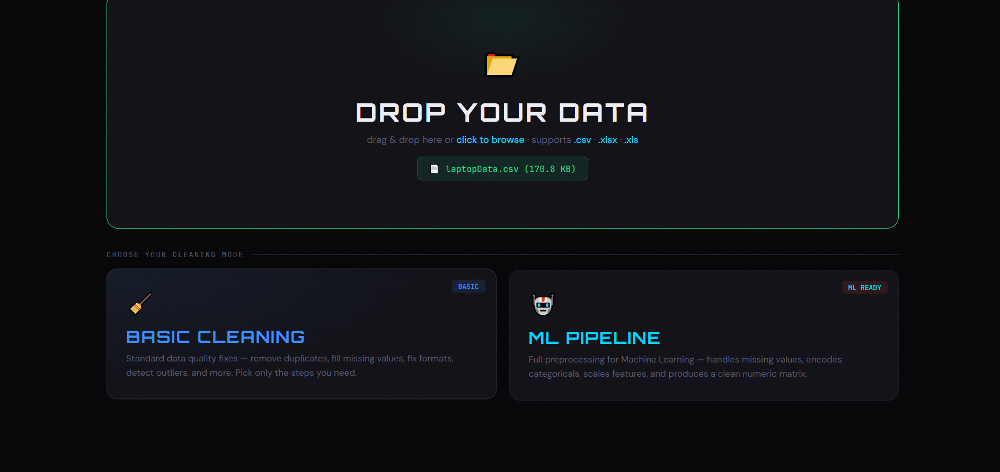
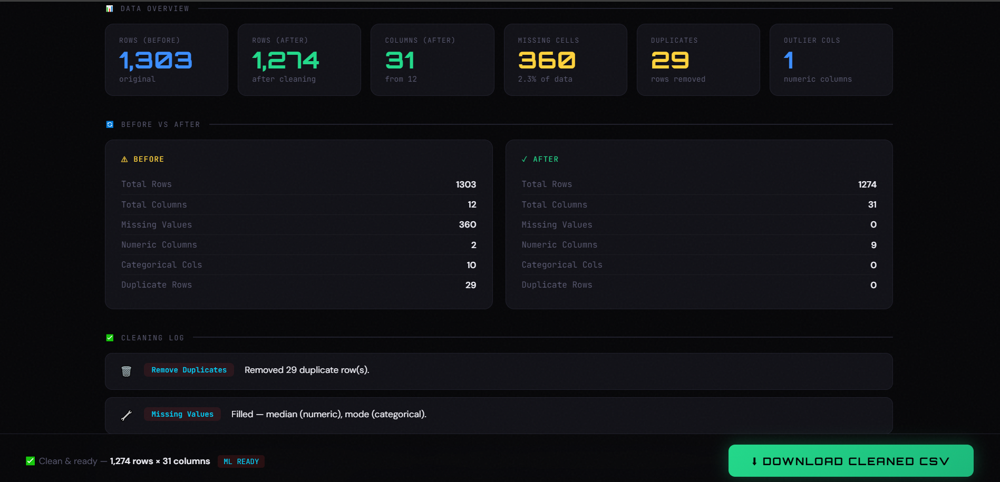

<p align="center">
  
</p>

<h1 align="center">git init – Smart Layered Automated Messy-data Cleaner</h1>

<p align="center">
  <a href="https://www.python.org/">
    
  </a>
  <a href="https://flask.palletsprojects.com/">
    
  </a>
  <a href="https://pandas.pydata.org/">
    
  </a>
  <a href="https://scikit-learn.org/">
    
  </a>
  <a href="https://numpy.org/">
    
  </a>
  <a href="LICENSE">
    
  </a>
</p>

---

##  Overview

**SLAM** is a fully local, drag-and-drop web application for cleaning and preparing data — built by **Slamani Abdelhafid**, AI & Data Science student at **Saint Petersburg State University**.

The name is both an acronym — **S**mart **L**ayered **A**utomated **M**essy-data cleaner — and a tribute to my family name. SLAM lets you drop any raw `.csv` or `.xlsx` file onto a browser interface, choose a cleaning mode, and instantly receive a clean, downloadable file alongside a full analytical data report. No cloud, no sign-up, no code required.

---

##  Key Features

*  **Drag-and-drop interface** — drop your file directly onto the browser screen
*  **Basic Cleaning Mode** — 8 individually toggleable cleaning steps
*  **ML Pipeline Mode** — full preprocessing pipeline ready for model training
*  **Full data report** — before/after comparison, column profiles, outlier counts, cleaning log
*  **One-click CSV download** — sticky download bar always visible after cleaning
*  **100% local** — all processing happens on your own machine, no data leaves your computer
*  **Zero dependencies on the frontend** — single HTML file, no npm, no build step

---

##  Technologies Used

| Technology | Purpose |
|---|---|
| **Python 3.10+** | Core backend language |
| **Flask 2.3+** | Local web server and API routing |
| **Pandas 2.0+** | File reading, DataFrame operations, all cleaning transforms |
| **NumPy 1.24+** | Numeric type detection, IQR computation, infinite value handling |
| **scikit-learn 1.3+** | LabelEncoder, StandardScaler, MinMaxScaler, KNNImputer |
| **openpyxl / xlrd** | Reading `.xlsx` and `.xls` Excel files |
| **HTML5 / CSS3 / JavaScript** | Single-file frontend with drag-and-drop and Fetch API |
| **Google Fonts** | Orbitron · DM Sans · JetBrains Mono |

---

##  Cleaning Modes

### 🔵 Basic Cleaning — Pick your steps

| # | Step | What it does |
|---|---|---|
| 1 | **Remove Duplicates** | Drops exact duplicate rows |
| 2 | **Handle Missing Values** | Fills nulls with median (numeric) or mode (categorical); drops columns >70% empty |
| 3 | **Fix Invalid Data** | Replaces ±∞, strips whitespace, converts string `"nan"` back to null |
| 4 | **Standardize Formats** | Normalizes emails to lowercase, strips phone number separators |
| 5 | **Remove Irrelevant Columns** | Drops constant-value columns and auto-detected row ID columns |
| 6 | **Check Data Consistency** | Fixes negative values in columns like `age`, `price`, `salary` |
| 7 | **Detect & Cap Outliers** | IQR method — Winsorizes extreme values to 1.5×IQR fences |
| 8 | **Validate & Fix Data Types** | Auto-converts text columns that are actually numbers or dates |

### 🔴 ML Pipeline — Full preprocessing in one click

| Step | Options |
|---|---|
| Remove duplicates | Always runs |
| Drop high-missing columns | Threshold: >50% missing |
| Handle missing values | Smart · Mean · Median · KNN · Drop rows |
| Encode categoricals | Auto · Always one-hot · Always label |
| Scale features | Standard (z-score) · MinMax (0–1) |
| Protect target column | Enter column name to exclude from scaling/encoding |

---

##  What the Report Shows

After every cleaning run, SLAM renders a full data report in the browser:

- **Overview cards** — rows, columns, missing cells, duplicates, outlier columns
- **Before vs. After** — side-by-side comparison of key metrics
- **Cleaning log** — plain-language description of every action taken
- **Column profiles** — type, cardinality, missing %, mean, std, min, max, outlier count per column
- **Data preview** — first 5 rows of the original file with null cells highlighted in red

---

##  Getting Started

### Prerequisites

- Python **3.10** or higher
- pip

### Installation

```bash
# 1. Unzip the project
unzip SLAM.zip
cd slam

# 2. (Recommended) Create a virtual environment
python -m venv venv
source venv/bin/activate      # Linux / macOS
venv\Scripts\activate         # Windows

# 3. Install dependencies
pip install -r requirements.txt

# 4. Run the server
python app.py
```

### Open in browser

```
http://localhost:5000
```

---

##  Project Structure

```
slam/
├── app.py                  # Flask backend — all data logic
├── requirements.txt        # Python dependencies
├── README.md               # This file
└── templates/
    └── index.html          # Complete frontend (HTML + CSS + JS)
```

---

##  Requirements

```txt
flask>=2.3
pandas>=2.0
numpy>=1.24
scikit-learn>=1.3
openpyxl>=3.1
xlrd>=2.0
```

---

##  Screenshots

| Drop Zone | Mode Selection | Results Report |
|---|---|---|
|  |  |  |

---

##  Author

**Slamani Abdelhafid**
AI & Data Science Student — Saint Petersburg State University

> *"SLAM is named after my family name, Slamani. It solves a real problem I face every day as a data student, and it carries my name."*

---

##  License

This project is licensed under the MIT License — see the [LICENSE](LICENSE) file for details.